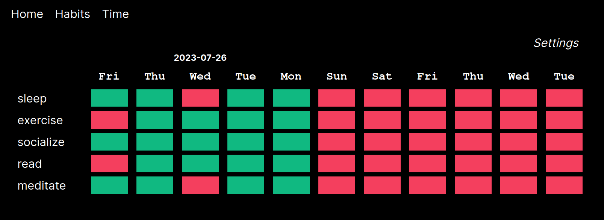
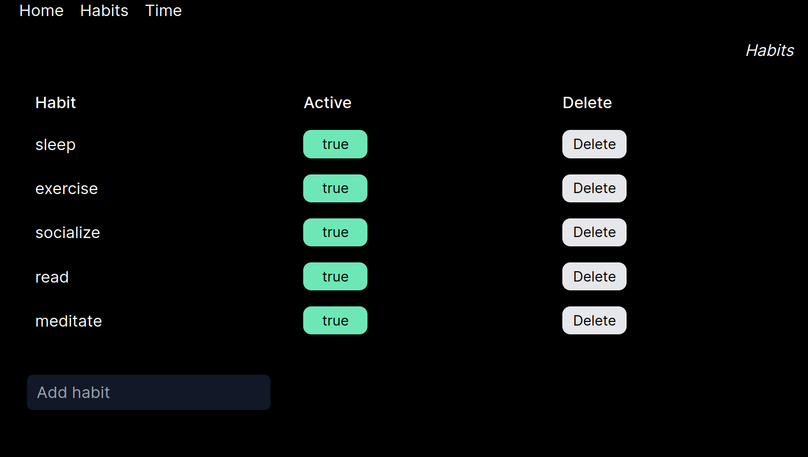
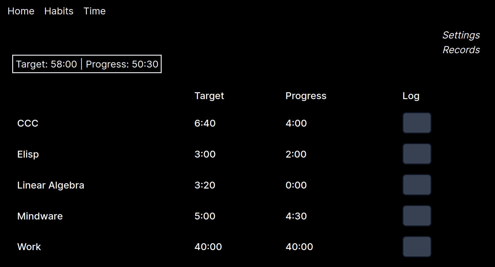

# Self Data App

This application provides a digital interfaces for habit tracking and weekly time-tracking which mirror my paper-based workflows.

# Running Locally (Supabase setup)

This repo can be cloned and run locally or from a VPS as long as the Supabase backend is setup.

Create a new (free) Supabase project and then use the schema.sql script to recreate the necessary tables in Supabase: `psql --file=schema.sql <database_url>`.

## Habits

The habits table displays the last 10 days since that's what I like to see. This can be modified in the file `/src/app/habits/page.tsx`. Dynamic date ranges are not a feature I need (in time tracking either). Habits can be set to active or inactive without being deleted.

### Habit Table

### Habit Config

## Time Tracking

The time tracking is on a weekly basis (Mon-Sun). Time targets are set in the "settings" and projects can toggled active/inactive like habits. Time goals are input in minutes and time is also logged in minutes. Time targets and progress are shown in hh:mm format for clarity.

### Time Table
